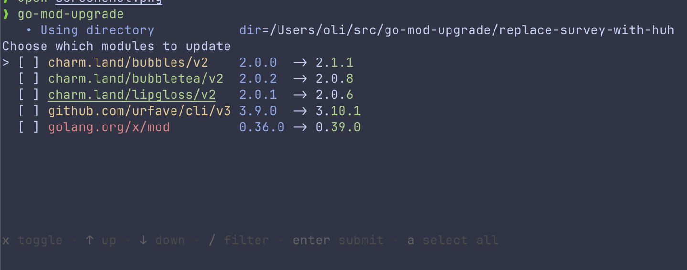

# go-mod-upgrade

[](https://github.com/oligot/go-mod-upgrade/actions/workflows/go.yaml) [](/license) [](https://github.com/oligot/go-mod-upgrade/releases/latest)

> Update outdated Go dependencies interactively



Note that only patch and minor updates are supported for now.

## Why

The Go wiki has a great section on [How to Upgrade and Downgrade Dependencies](https://go.dev/wiki/Modules#how-to-upgrade-and-downgrade-dependencies). One can run the command

```bash
go list -u -f '{{if (and (not (or .Main .Indirect)) .Update)}}{{.Path}}: {{.Version}} -> {{.Update.Version}}{{end}}' -m all 2> /dev/null
```

to view available upgrades for direct dependencies. Unfortunately, the output is not actionable, i.e. we can't easily use it to update multiple dependencies.

This tool is an attempt to make it easier to update multiple dependencies interactively. This is similar to [yarn upgrade-interactive](https://legacy.yarnpkg.com/en/docs/cli/upgrade-interactive/), but for Go.

## Install

Pre-compiled binaries for Windows, OS X and Linux are available in the [releases page](https://github.com/oligot/go-mod-upgrade/releases).

Alternatively, with the Go toolchain, you can do

```
go install github.com/oligot/go-mod-upgrade@latest
```

## Usage

In a Go project which uses modules, you can now run

```
go-mod-upgrade
```

### List available upgrades

To see what upgrades are available without any interactivity, use the `--list` flag:

```
go-mod-upgrade --list
```

This will display all available module upgrades using the same color coding as the interactive mode, making it perfect for CI/CD pipelines or when you just want to check what's available.

Both version columns highlight from the leftmost part that changes rightwards, so the scale of the step is visible at a glance. That part takes the same colour in each, since it is one change seen twice; the rest of each version recedes, further in the one being left behind. The colour says which part moved:

- red for a new major version, where nothing of the old version remains
- yellow for a new minor
- green for a new patch
- magenta for a change of prerelease

Module names are left plain, which keeps colour beside a module meaning one thing: the advisory column has its own colours, and the two should not compete.

Colour can be turned off with `--no-color`, which is also the effect of setting `NO_COLOR`.

The colours assume a dark background, since there is no dependable way to ask a terminal what its background is. On a light one, name the `light` palette, which swaps the colours that wash out on white:

```console
$ go-mod-upgrade --colors light
```

Individual roles can be recoloured, either on their own or after a palette name:

```console
$ go-mod-upgrade --colors "cve=bold+red,from=faint"
$ go-mod-upgrade --colors "light,to-minor=cyan"
```

The roles are `name`, `fixes`, `indirect`, `transitive`, `deprecated`, `retracted`, `archived`, `from`, `to`, `to-major`, `to-minor`, `to-micro`, `to-prerelease`, `cve`, `cve-reachable`, `required-by` and `heading`. Each takes attributes joined by `+`, from the eight terminal colours plus `bold`, `faint`, `italic`, `underline` and `none`. Naming the base colours rather than exact shades lets the terminal's own theme decide how they look. Roles left unset keep the palette's own choice.

### Indirect dependencies

By default only direct dependencies are listed. Use the `--indirect` flag to also consider the indirect requirements recorded in `go.mod`:

```
go-mod-upgrade --indirect
```

Indirect modules carry an `i` in the label column, alongside anything else the module has earned. Only the requirements written in `go.mod` are offered, so upgrading them changes the recorded versions without adding new entries, and there is no need to run `go mod tidy` afterwards.

### The whole module graph

`--all` goes further and offers every module in the build list, including those reached only through other modules and so absent from `go.mod`:

```
go-mod-upgrade --all
```

Each module is shown with what pulls it in, so the reach of an upgrade is visible before accepting it:

```
golang.org/x/sys   0.42.0 -> 0.47.0  github.com/cloudflare/circl +8 more
gopkg.in/yaml.v3   3.0.1  -> 3.0.2   github.com/stretchr/testify
```

Upgrading a module that `go.mod` does not record adds a requirement to it, which only `go mod tidy` removes again, so `--all` says as much when it starts.

In a workspace, `--all` gathers every member into one list rather than asking about the same upgrade once per member, and the modules named are the members that require it. Choosing a module then asks which of them to upgrade, since whether a requirement is direct differs between members.

### Sorting

`--sort` takes a comma-separated chain of keys, each breaking ties for the one before it. The default is `+fixes,+cve,+direct,+transitive,+delta,+name`, which reads as a priority list: the upgrades that clear an advisory elsewhere, then the advisories needing direct action, then what the code imports directly. Being handled by another upgrade demotes a module below all of those, and the size of the change settles the rest, with the name settling anything still equal.

```console
$ go-mod-upgrade --sort "+delta,+name"
```

A key may be signed: `-` reverses it and `+` is the default. The keys are

- `cve` leads with the advisories the code reaches, then those merely present
- `name` compares paths without case, so related paths stay together
- `major`, `minor`, `micro` and `prerelease` compare how far that part of the version moves, the largest jump first
- `delta` stands for the four version keys together
- `deps` compares how many modules depend on each one, widest impact first
- `direct` puts the modules imported directly ahead of those reached only through another
- `disowned` leads with the modules given up on, since no upgrade resolves that
- `fixes` leads with the upgrades that resolve an advisory elsewhere, the most first
- `transitive` demotes the modules another upgrade already handles
- `tags` compares the build configurations that reach each module, the plain build first

The version keys compare the size of the jump rather than merely that something changed, so `0.4 -> 0.40` sorts above `0.1.14 -> 0.1.15`. Modules below v1 are compared on the same terms as any other.

Whatever the chain, names settle anything it leaves equal, so a listing does not shuffle between runs. Where a module is listed once per configuration reaching it, the configurations settle what the name cannot, keeping its rows together and in the same order every run. `deps` needs the dependency graph that `--all` gathers, and is ignored without it.

### Vulnerabilities

`--vuln` reports the advisories affecting each module's current version, so an upgrade that resolves one is visible as such:

```console
$ go-mod-upgrade --list --indirect --vuln
golang.org/x/term  Fi                  0.1.0  -> 0.45.0  fixes golang.org/x/sys
golang.org/x/text  i   CVE-2026-56852  0.4.0  -> 0.40.0
golang.org/x/sys   iT  CVE-2026-39824  0.42.0 -> 0.47.0  fixed by golang.org/x/term
```

Advisories sit between the name and the versions, since they are the reason to act. Those reaching code this module actually calls are shown in bold red, and those merely present in a dependency in yellow. `--verbose` adds the Go advisory identifier, the version carrying the fix, and a link.

The colours here describe security exposure, while those on the versions describe how disruptive the upgrade is. The two are deliberately kept in separate columns, since a module can be a safe patch bump that fixes a reachable vulnerability, or a breaking change with no security implication at all.

The scan runs in this process, using the same database and analysis as `govulncheck`, and no vulnerability score is shown because the Go vulnerability database does not publish one.

The database is kept in a `go-mod-upgrade` directory inside whichever directory the platform uses for caches, and reused between runs. It is revalidated against the server each time, so it is replaced when it changes and reused otherwise, and only one copy is kept. If the server cannot be reached the cached copy is used and its age reported. If the cache cannot be written the scan falls back to the published database, so it is never required.

If the scan cannot complete, most often because the packages will not load, `--vuln` reports the failure and exits non-zero rather than presenting an unscanned tree as a clean one.

### Labels

The label column answers why a row is where it is. Each label is one letter, so several fit in a narrow column:

```console
$ go-mod-upgrade --list --all --indirect --show=+disowned --policy=policy.json,archived.json
MODULE                            LABELS  FROM    TO      REQUIRED BY
github.com/AlecAivazis/survey/v2  A       2.3.7   2.3.7   github.com/oligot/go-mod-upgrade
github.com/aws/aws-sdk-go         iD      1.20.6  1.55.8
github.com/golang/protobuf        iD      1.3.1   1.5.4
gopkg.in/yaml.v2                  iA      2.2.2   2.4.0
```

| Label | Meaning                                         | Where it comes from  |
| ----- | ----------------------------------------------- | -------------------- |
| `F`   | upgrading this resolves an advisory elsewhere   | the dependency graph |
| `i`   | required only indirectly                        | `go.mod`             |
| `T`   | another upgrade resolves this module's advisory | the dependency graph |
| `D`   | the author deprecated the module                | `go list -u`         |
| `R`   | the author withdrew the version in use          | `go list -retracted` |
| `A`   | a policy asserts the module is abandoned        | the policy file      |

Their order mirrors the default sort, so the labels read as the priority the listing is ordered by: a row leading with `F` is the same statement as a row sitting at the top. A module nobody has said anything about carries none, and the column disappears from a listing that needs it for nothing.

`--show=+disowned` keeps the modules given up on, whether by their author or by a policy. A module can be perfectly current and still be a liability, because whoever wrote it has stopped.

`D` and `R` are found for free. Both are declared upstream and reported by `go list`, and the two differ in a way worth keeping straight: a deprecation describes the module, so no upgrade resolves it, while a retraction describes the version in use, so upgrading usually does. `--verbose` and the `json` format carry the author's own message, which normally names the successor:

```json
{
  "modules": {
    "github.com/golang/protobuf": {
      "version": "v1.3.1",
      "update": "v1.5.4",
      "indirect": true,
      "deprecated": "Use the \"google.golang.org/protobuf\" module instead."
    },
    "gopkg.in/yaml.v3": {
      "version": "v3.0.1",
      "indirect": true,
      "archived": "go-yaml/yaml archived and declared unmaintained by its author; consider github.com/goccy/go-yaml"
    }
  }
}
```

#### Archived repositories, and why they need a file

`A` is different, and it is the one that needs explaining. It is asserted rather than observed: someone writes it down, and the tool can neither confirm nor refute it.

That is not a gap waiting to be closed. An author who walks away does not file a deprecation notice, because filing one is work and walking away is the absence of work. The two signals turn out to be almost perfectly opposed:

| Module                                  | Repository archived | Declares `Deprecated` |
| --------------------------------------- | ------------------- | --------------------- |
| `github.com/golang/protobuf`            | no                  | **yes**               |
| `gopkg.in/yaml.v2`                      | **yes**             | no                    |
| `gopkg.in/yaml.v3`                      | **yes**             | no                    |
| `github.com/dgrijalva/jwt-go`           | **yes**             | no                    |
| `github.com/golang/mock`                | **yes**             | no                    |
| `github.com/mitchellh/mapstructure`     | **yes**             | no                    |
| `github.com/opentracing/opentracing-go` | **yes**             | no                    |

The modules whose repositories are shut announce nothing, and the one that announces loudly is still open. Whether a repository is archived is known to the forge hosting it and not to the Go toolchain, and reaching for it would mean a network call to a service that may not be reachable and cannot be checked offline. So the assertion is written down instead, in a file a reviewer can read:

```json
{
  "modules": {
    "gopkg.in/yaml.v2": {
      "archived": "go-yaml/yaml archived and declared unmaintained by its author; consider github.com/goccy/go-yaml"
    }
  }
}
```

An `archived.json` ships with this tool, holding the modules whose repositories were confirmed shut when it was written. It names only what the toolchain will not tell you: `github.com/golang/protobuf` is absent because it declares its own deprecation, and duplicating that would only let the copy go stale.

A mark carries a reason rather than a bare `true`, because an assertion nothing can verify is worth only as much as the note explaining it. The reason is reported when the rule fires, so the fix travels with the finding:

```console
! gopkg.in/yaml.v2  archived
    go-yaml/yaml archived and declared unmaintained by its author; consider github.com/goccy/go-yaml
```

The file holds no `rules` of its own, so stack it on a policy that has them and it contributes only facts:

```console
$ go-mod-upgrade --list --all --indirect --show=+all --policy=policy.json,archived.json
```

Policy files reject any key they do not recognise, since a typo in a security file should stop the run rather than be ignored. That applies to a comment too, so `archived.json` carries none: whatever needs saying about an entry belongs in its reason, where the tool will print it.

Two limits are worth stating plainly. A module nobody has marked raises nothing, so this narrows the gap rather than closing it. And an entry goes stale silently, in the one direction that matters least — a project that revives keeps warning until someone deletes the line, which is the safer way round.

### Upgrades that resolve an advisory elsewhere

Go selects the highest version any module asks for, so upgrading a dependent lifts a vulnerable module when the dependent's own `go.mod` already requires the fixed version. That upgrade is worth more than the row reporting the advisory: taking it clears the finding.

```console
$ go-mod-upgrade --list --all --indirect --vuln
MODULE               LABELS  ADVISORY        FROM          TO      RESOLVES
golang.org/x/net     Fi                      a158d28d115b  0.57.0  fixes golang.org/x/sys, golang.org/x/text
golang.org/x/term    Fi                      0.1.0         0.45.0  fixes golang.org/x/sys
golang.org/x/text    iT      CVE-2026-56852  0.4.0         0.40.0  fixed by golang.org/x/crypto, golang.org/x/net
golang.org/x/sys     iT      CVE-2026-39824  0.42.0        0.47.0  fixed by golang.org/x/crypto, golang.org/x/net
```

A row marked `F` says what taking it would fix; one marked `T` says what will fix it. The default sort leads with the first and demotes the second, so the top of a listing is what to act on rather than what to worry about.

Whether an upgrade qualifies is read from the candidate's own `go.mod`, which Go's module cache already holds, so this costs no network beyond what discovery already does. The version has to reach the fix: of `golang.org/x/sys`'s dependents, only `x/term` and the three above ask for anything past it, and upgrading `go-isatty` would not help however new it is.

A mark says some upgrade would resolve the advisory, not that it is the one to take. Version selection is global, so a third module pinning the vulnerable version lower can defeat it; the direct upgrade stays on the row, and that always works.

### Vulnerabilities in the standard library

An advisory in the standard library belongs to the toolchain rather than to a dependency, and has no entry in `go.mod` to attach to. It gets a row of its own:

```console
go (toolchain)  CVE-2026-42505, CVE-2026-39822, ... 1.25.9 -> 1.25.12
```

One row rather than one per advisory, since a single release resolves everything fixed at or below it. The version comes from the `go` directive, or from `toolchain` when the file pins one. It is never offered for upgrade interactively, since `go get` cannot move either directive -- the fix is to edit the file.

A policy can gate on it like anything else, quoting the name for the space:

```json
{ "modules": { "go (toolchain)": { "allow": ">= v1.25.12" } } }
```

### Build configurations

A build tag decides which files compile, and so which modules the build reaches and which of their code it calls. Analysing only what a plain build sees therefore under-reports: a project whose tests hide behind a tag pulls in dependencies that a plain build never touches.

Every configuration the project declares is analysed, and the findings are combined:

```console
$ go-mod-upgrade --list --all --indirect --vuln
   • Analysing several build configurations configurations=*, integration
MODULE                       ADVISORY        FROM                TO                  TAGS         REQUIRED BY
github.com/dgrijalva/jwt-go  CVE-2020-26160  3.2.0+incompatible  3.2.0+incompatible  integration  sweepdemo
```

That advisory is invisible to a plain build: the call reaching it sits in a file guarded by `//go:build integration`. The `TAGS` column names the configurations that reach a module, and is dropped from a listing where no module carries one.

The configurations come from the project's own `//go:build` lines, and a line describing several builds contributes one each: `integration && (core || opensearchtransport)` is two configurations, since a module the second reaches may be absent from the first. The plain build is written `*`, since it sets no tags at all -- a name a constraint could also spell would be ambiguous, a project being free to declare `//go:build default`.

A configuration is named by the tags it sets, so `integration && core` reads `core && integration` however it was written, and the name is a build constraint `--tags` takes back. Two configurations setting the same tags are one, so `integration && core` and `integration && core && !multinode` are analysed once, as are two lines that differ only in how they are arranged. What the toolchain decides for itself -- the GOOS and GOARCH being built for, the release it is -- is left to it rather than enumerated.

A module is listed once per configuration reaching it, so one reached two ways is two rows, each naming its own configuration. The sort keeps a module's rows together, leaving them to be collapsed by eye rather than read out of a crowded cell. An empty `TAGS` says no build reaches the module at all -- a requirement nothing imports. A module reached whatever is set reads `*`, since naming each configuration would only repeat that it is always in the build; `--width=-1` names them, as it also writes versions in full.

The selection prompt lists a module once however many configurations reach it, since the choice is which module to upgrade rather than which build to upgrade it in. `--format=json` likewise keeps one entry per module, with the configurations as a `tags` array: the rows exist to be read, and a machine wants the set.

Where the plain build is the only configuration reaching a module, what excludes it is named too: `* !integration` means the module is in the plain build and drops out when `integration` is set. The negation covers the whole configuration rather than each tag, so `!(core && integration)` does not claim the module needs neither, and a configuration another implies is dropped, so `integration` absorbs `core && integration`. Configurations are separated by a space and quoted when they contain one, as in `* "!(core && integration)"`.

In a workspace each member sweeps the configurations it declares, and a module is judged against the members that reached it.

`--tags` says which configurations to analyse, as build constraints:

```console
$ go-mod-upgrade --vuln --tags="integration && core"    # only this one
$ go-mod-upgrade --vuln --tags="+integration && core"   # the usual, plus one
$ go-mod-upgrade --vuln --tags="-integration"           # the usual, less those
```

An unsigned constraint replaces what the project declared, which is the escape hatch for a project with more configurations than anyone wants swept. A signed one adjusts it: `+` adds a configuration, and `-` drops every discovered one whose tags satisfy the constraint, so `-integration` means "not the integration ones" without naming the rest. Mixing the two forms is refused rather than guessed at.

A constraint holds `&&` and `!`, which a shell reads first, so quote it.

An advisory reachable under any configuration counts as reachable: someone building that way runs the code. A configuration that cannot be analysed reports an error rather than an absence, since a caller deciding whether a tree is clean must be able to tell "nothing found" from "could not look".

### Columns

`--columns`, or `-k`, decides which columns a listing has, using the same signed syntax as `--sort` and `--show`. The keys are `name`, `label`, `cve`, `from`, `to`, `hint`, `tags` and `required-by`.

```console
$ go-mod-upgrade --list -k name,label,from,to    # exactly these
$ go-mod-upgrade --list -k +required-by          # the usual, plus one
$ go-mod-upgrade --list -k -hint                 # the usual, less one
```

An unsigned list replaces what the flags implied; signed keys adjust it. Mixing the two is refused rather than guessed at, since `name,+hint` could mean either.

Which columns a listing starts with depends on what was gathered: `--vuln` adds the advisory and hint columns, `--all` adds what pulls a module in. A column no module fills is dropped, so a heading never sits over nothing.

`--headers`, or `-H`, precedes the listing with column names. It is on at a terminal and off when redirected, since a heading helps a person and hinders anything parsing the output; `-H=false` and `-H=true` settle it either way. With headers on the `->` between versions goes, `FROM` and `TO` having named them.

`--width`, or `-w`, says how wide a listing may be: `0` for the terminal's own width, which is the default, `-1` for unlimited, and anything else as given. Unlimited also writes versions in full -- a module pinned to a commit shows as `a158d28d115b` rather than `0.0.0-20220722155237-a158d28d115b` unless there is room for everything.

### Choosing what is listed, and how

`--show` decides which modules appear, using the same key syntax as `--sort`. The default is `+delta`, the modules with an upgrade available, which is what the tool has always listed.

- `cve` keeps the modules carrying an advisory
- `delta` keeps those with a newer version available
- `direct` and `indirect` keep them by how they are required
- `disowned` keeps those given up on, whether by their author or by a policy
- `all` keeps everything

Keys combine, so `--show=+cve,+delta` keeps a module with either, and a negated key excludes regardless: `--show=+all,-indirect` is everything required directly.

Every module is discovered whether or not it has an upgrade available, so `+all` means every module the scope covers, and a policy sees all of them. The default `+delta` then narrows the listing to the modules worth acting on, which is what the tool has always shown.

`--format` decides how they are written. `text` is the listing above. `json` is a report for other tooling, carrying the versions, the advisories, and how many of them the code reaches; a module already at its newest version carries no `update` field. `policy` is the module map of a policy file:

```console
$ go-mod-upgrade --list --all --indirect --show=+all --format=policy > allow-list.json
```

Progress and log lines go to standard error, so a redirected listing holds only the listing.

Each generated entry defers to `go.mod` rather than naming a version, since that file already records it and two copies would drift. Regenerating produces the same bytes unless the set of modules changed, so the file stays reviewable in a diff.

### Policy

`--policy` checks the modules against one or more policy files and leaves a failing status when they are not permitted, which is what a CI target needs.

```console
$ go-mod-upgrade --list --all --indirect --show=+all \
    --policy=policy.json,allow-list.json
```

A policy judges every module, while the listing shows what `--show` keeps, and the two are worth lining up. The default `+delta` hides a module with no upgrade available, which is exactly the kind that gets reported — a module nobody can upgrade is the worst case for an advisory, not the safest. Pairing a policy with `--show=+all` puts the same modules in the listing and the report, so a failure can be read against the row it came from.

A policy permits nothing it does not name, so it is an allow-list. A security-managed baseline can be distributed and a project add what it needs: files are merged in order, field by field, and the later one wins for a field both set. Anything mutually exclusive belongs in a second run rather than a rule that has to be reconciled.

Merging per field is what lets an assertion be distributed on its own. `allow` and `deny` are two halves of one statement about permission, so setting either replaces both; `archived` says something else entirely and is left alone. A regenerated allow-list therefore restates what a module is permitted without erasing the note saying it was abandoned.

```json
{
  "actions": {
    "fail": { "exit": 1 },
    "warn": { "exit": 0, "log": "warn" }
  },
  "modules": {
    "**": { "deny": "*" },
    "golang.org/x/**": { "allow": ">= v0.30.0" },
    "golang.org/x/text": { "allow": "go.mod" }
  },
  "rules": [
    { "when": "vuln-reachable", "then": "fail" },
    { "when": "vuln-present", "then": "warn" },
    { "when": "not-allowed", "then": "fail" },
    { "when": "version-denied", "then": "fail" }
  ]
}
```

A pattern names a module path, where `*` matches one segment and `**` the rest, so `**` alone is how a policy states its default. The most specific pattern decides, a literal segment counting for more than a wildcard, so the order the rules appear in cannot change the outcome.

A constraint is a comma-separated semver range, combined with AND, or the word `go.mod` to accept whatever that file records. Deferring to `go.mod` keeps the version in the one document that already holds it.

The conditions each describe a different problem, so each suggests its own fix:

| Condition        | Meaning                                                 | Fix                   |
| ---------------- | ------------------------------------------------------- | --------------------- |
| `vuln-reachable` | this code calls the vulnerable symbol                   | upgrade the module    |
| `vuln-present`   | the module carries an advisory this code does not reach | note it               |
| `deprecated`     | the author deprecated the module                        | move to the successor |
| `retracted`      | the author withdrew the version in use                  | upgrade the module    |
| `archived`       | a policy asserts the module is abandoned                | plan a replacement    |
| `not-allowed`    | no rule covers the module                               | add a rule            |
| `denied`         | a rule refuses the module                               | reconsider that rule  |
| `version-denied` | a rule covers it, the version falls outside             | move the module       |

Being disowned says nothing about whether a module is permitted, so these are reported independently of the verdict: a module can be allowed by the policy and still have been given up on upstream.

A condition names an action, and the action says what to do, so what `fail` means is stated once. Every violation is reported before the run ends, so one run shows all the work. The status left behind is the highest any action asked for, so a warning alongside a failure still fails. A process status is a single byte, so `"exit": -1` is observed as `255`, and a value that would wrap to zero is reported as `1` rather than passing silently.

A policy with no rules can only ever pass, so it is refused rather than left to fail open. The check is made after every file is read, which lets a generated allow-list name only its modules and take the rules from the baseline it is merged with.

A policy naming a `vuln-` condition turns scanning on by itself, so the flags cannot fall out of step with a file the caller may not have written. `deprecated` and `retracted` need no scan, since `go list` reports them, and neither does `archived`, which comes from the policy itself.

A policy deciding that advisories matter can also decide which build configurations they are looked for in, so a CI target need name nothing but the policy:

```json
{
  "tags": ["+integration && core"],
  "actions": { "fail": { "exit": 1 } },
  "rules": [{ "when": "vuln-reachable", "then": "fail" }]
}
```

The form is the one `--tags` takes. Stacked files accumulate their configurations rather than the last one winning, which is the opposite of how `allow` and `deny` merge: a baseline naming the integration build and an overlay naming another both want covering, neither expressing a preference between them, so dropping one would silently narrow the analysis. Naming the same configuration twice asks for it once.

`--tags` on the command line overrides the file. The policy states an intent; an operator narrowing a run is answering a question the file could not.

`--ignore` withholds an upgrade; it does not exempt a module from the policy. A module it matches is still checked and can still fail the run. An exemption belongs in the policy, where a reviewer can see it:

```json
{ "modules": { "golang.org/x/text": { "allow": "*" } } }
```

The allow-list itself is generated from a real run, then edited:

```console
$ go-mod-upgrade --list --all --indirect \
    --show=+all --format=policy > allow-list.json
```

### Adopting a policy

A policy is meant to be adopted on a tree that already has dependencies, which means starting from what is there rather than from nothing. Generate the allow-list first, review it, then check against it:

```console
$ go-mod-upgrade --list --all --indirect --show=+all \
    --format=policy > allow-list.json
$ git add allow-list.json && git commit -m "record the dependencies as they stand"
$ go-mod-upgrade --list --all --indirect --show=+all \
    --policy=policy.json,archived.json,allow-list.json
```

The first run records the tree; the second should pass, since everything in it was just permitted. Commit the generated file before the checking run, so the baseline is in the history rather than only on disk.

The order the files are named does not decide anything. The most specific pattern wins whatever it was read from, and merging is per field, so a regenerated allow-list restating a module's permission leaves an `archived` note from another file standing. Order matters only when two files set the same field of the same pattern, and then the later one wins.

Wire it into whatever runs the tests:

```make
.PHONY: deps-check
deps-check:
	go-mod-upgrade --list --all --indirect --show=+all --vuln \
	    --policy=policy.json,archived.json,allow-list.json

.PHONY: deps-record
deps-record:
	go-mod-upgrade --list --all --indirect --show=+all \
	    --format=policy > allow-list.json
```

`deps-check` fails the build when a dependency is not permitted. `deps-record` regenerates the allow-list, and is what a reviewer runs deliberately after deciding a new dependency is acceptable — its diff is the record of that decision.

`--show=+all` is worth keeping on the checking run even though it lists more: it means every module the policy judged is also on screen, so a failure can be read against its row. A policy naming a `vuln-` condition turns scanning on regardless, so `--vuln` above is stating the intent rather than enabling it.

Two things follow from an allow-list being exhaustive, and both are the point rather than an inconvenience:

**A new dependency fails the build.** Adding one, or an upgrade pulling in something new, means a module no rule covers, which is `not-allowed`. That is the gate doing its job: a dependency arriving without anyone noticing is what it exists to prevent. Regenerate and commit, and the diff says which module was accepted and when.

**Every entry defers to `go.mod`,** so an upgrade fails until the allow-list is regenerated. To ratchet a version instead, name the floor rather than the file:

```json
{ "modules": { "golang.org/x/text": { "allow": ">= v0.40.0" } } }
```

That permits `v0.40.0` and anything above it, so upgrades pass without regenerating while a downgrade below the floor still fails. It suits the modules worth pinning a minimum on — the ones carrying a fix you do not want to lose — and `go.mod` suits the rest.

Two flags earn their keep on a real tree. `--all` reaches modules absent from `go.mod`, which is where most of a build actually lives, and it warns that upgrading one adds a requirement that only `go mod tidy` removes again. `--indirect` covers what `go.mod` records but the code does not import directly.

If `--vuln` cannot load the packages it will not scan, and a policy naming a `vuln-` condition then fails the run rather than reporting a clean tree. A module needing a `GOEXPERIMENT` the toolchain was not asked for is the usual cause, so a CI target should set whatever the build needs.

### Environment variables

Each of these sets the default for the option of the same name, so a preference need not be repeated on each run:

| Variable                   | Option        |
| -------------------------- | ------------- |
| `GO_MOD_UPGRADE_VULN`      | `--vuln`      |
| `GO_MOD_UPGRADE_INDIRECT`  | `--indirect`  |
| `GO_MOD_UPGRADE_ALL`       | `--all`       |
| `GO_MOD_UPGRADE_SORT`      | `--sort`      |
| `GO_MOD_UPGRADE_WORK_SYNC` | `--work-sync` |
| `GO_MOD_UPGRADE_IGNORE`    | `--ignore`    |
| `GO_MOD_UPGRADE_HOOK`      | `--hook`      |
| `GO_MOD_UPGRADE_FORCE`     | `--force`     |
| `GO_MOD_UPGRADE_LIST`      | `--list`      |
| `GO_MOD_UPGRADE_VERBOSE`   | `--verbose`   |
| `GO_MOD_UPGRADE_NO_COLOR`  | `--no-color`  |
| `GO_MOD_UPGRADE_COLORS`    | `--colors`    |
| `GO_MOD_UPGRADE_SHOW`      | `--show`      |
| `GO_MOD_UPGRADE_FORMAT`    | `--format`    |
| `GO_MOD_UPGRADE_COLUMNS`   | `--columns`   |
| `GO_MOD_UPGRADE_HEADERS`   | `--headers`   |
| `GO_MOD_UPGRADE_WIDTH`     | `--width`     |
| `GO_MOD_UPGRADE_TAGS`      | `--tags`      |
| `GO_MOD_UPGRADE_POLICY`    | `--policy`    |

`GO_MOD_UPGRADE_CACHE` sets where the vulnerability database is cached. It defaults to a `go-mod-upgrade` directory inside whichever directory the platform uses for caches, and any message about the cache names the path in use.

A flag given on the command line takes precedence:

```console
export GO_MOD_UPGRADE_VULN=true
export GO_MOD_UPGRADE_SORT=+cve,+direct,+delta,+name
```

### Workspaces

In a [workspace](https://go.dev/ref/mod#workspaces), every module named by a `use` directive in `go.work` is offered in turn. Paths are resolved relative to the `go.work` file, so the tool can be run from anywhere in the workspace, and a module that cannot be read is reported and skipped rather than stopping the run.

Each module is inspected on its own, so a dependency is only offered for the modules that actually require it.

After updating, `go work sync` can be run to bring the whole workspace onto the selected versions:

```
go-mod-upgrade --work-sync
```

This is off by default, because it rewrites the `go.mod` of every module in the workspace rather than only the ones that were updated.

Additional options can be specified via the CLI global options:

```
GLOBAL OPTIONS:
   --pagesize float, -p float                                 Number of modules to display (% of terminal when <=1.0, or absolute number of rows) (default: 0.8)
   --force, -f                                                Force update all modules in non-interactive mode [$GO_MOD_UPGRADE_FORCE]
   --list, -l                                                 List available module upgrades without interactivity [$GO_MOD_UPGRADE_LIST]
   --verbose, -v                                              Verbose mode [$GO_MOD_UPGRADE_VERBOSE]
   --hook string                                              Hook to execute for each updated module [$GO_MOD_UPGRADE_HOOK]
   --ignore string, -i string [ --ignore string, -i string ]  Ignore modules matching the given regular expression [$GO_MOD_UPGRADE_IGNORE]
   --indirect                                                 Also show indirect dependencies declared in go.mod [$GO_MOD_UPGRADE_INDIRECT]
   --all                                                      Show every module in the build list, not only those recorded in go.mod [$GO_MOD_UPGRADE_ALL]
   --vuln                                                     Report known vulnerabilities affecting each module [$GO_MOD_UPGRADE_VULN]
   --sort string                                              Sort by a comma-separated chain of cve, name, major, minor, micro, prerelease, delta, deps, direct, disowned, transitive, fixes, tags, each optionally signed (default: "+fixes,+cve,+direct,+transitive,+delta,+name") [$GO_MOD_UPGRADE_SORT]
   --policy string [ --policy string ]                        Check the modules against policy files, merged in order [$GO_MOD_UPGRADE_POLICY]
   --show string                                              Show modules matching a comma-separated chain of cve, delta, direct, indirect, disowned, transitive, fixes, all, each optionally signed (default: "+delta") [$GO_MOD_UPGRADE_SHOW]
   --format string                                            Write the listing as text, policy, json (default: "text") [$GO_MOD_UPGRADE_FORMAT]
   --columns string, -k string                                Show these columns, a comma-separated chain of name, label, cve, from, to, hint, tags, required-by, each optionally signed to adjust the default rather than replace it [$GO_MOD_UPGRADE_COLUMNS]
   --headers, -H                                              Precede the listing with column headings (default: when writing to a terminal) [$GO_MOD_UPGRADE_HEADERS]
   --tags string [ --tags string ]                            Build configurations to analyse, as build constraints; signed to adjust what the project declares rather than replace it [$GO_MOD_UPGRADE_TAGS]
   --width int, -w int                                        Columns a listing may use, 0 for the terminal's own width and -1 for unlimited (default: the terminal's width) [$GO_MOD_UPGRADE_WIDTH]
   --no-color                                                 Disable colour in the output [$GO_MOD_UPGRADE_NO_COLOR]
   --colors string                                            Override colours as role=attributes pairs, as in "cve=bold+red,from=faint" [$GO_MOD_UPGRADE_COLORS]
   --work-sync                                                Run go work sync after updating, in workspace mode [$GO_MOD_UPGRADE_WORK_SYNC]
   --help, -h                                                 show help
   --version                                                  print the version
```

## Integration

You may also use go-mod-upgrade with these tools:

- [Dev Container Feature](https://github.com/thediveo/devcontainer-features/blob/master/src/go-mod-upgrade/README.md)
